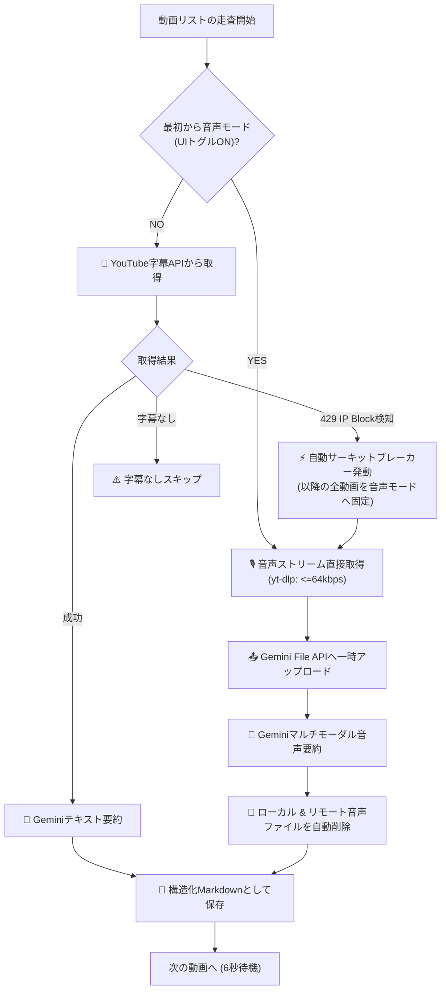

# [改善] 音声ストリーム直接要約フォールバックとUIサーキットブレーカー機能の追加 (Issue #11)

## 📋 1. 実装計画書 (Implementation Plan)

### 1.1 背景と課題
- YouTubeの字幕エンドポイント（`www.youtube.com/api/timedtext`）は、短時間の連続アクセスや同一IPからの集中アクセスによって **YouTube側からIPブロック（HTTP 429 / IpBlocked）** を受けることがあります。
- 一度IPブロックされると数時間〜1日以上ブロックが継続し、全動画が「字幕が存在しないか取得できなかったためスキップ」となり、ナレッジ抽出が全停止してしまいます。
- 一方、`yt-dlp` による **音声ストリーム（CDN配信）のダウンロードはIPブロックを受けず、0.5秒程度で取得可能** であることが判明しました。

### 1.2 目的と解決方針
1. **超軽量音声ストリームの高速一時取得パイプラインの構築**:
   - `ba[abr<=64]/ba/b` 指定により、人間の会話認識に十分かつ最小限（15分動画で6〜7MB程度）の音声ストリームを取得。
2. **Gemini マルチモーダル音声直接要約**:
   - 音声ファイルをGemini File APIにアップロードし、字幕テキストを介さずに音声から直接タイムスタンプ付き構造化Markdownを生成。
3. **UI手動サーキットブレーカー（最初から音声モード）の新設**:
   - Streamlit UI上に「最初から音声モードで取得（YouTube字幕APIを完全バイパス）」フラグを追加。すでにブロックされている環境でも初手から安全に実行可能にする。
4. **自動サーキットブレーカー（動的フェイルオーバー）の実装**:
   - 通常モードで実行中、1度でもYouTubeのIP制限（429）を検知した場合、以降の全動画を自動で音声ストリーム直接取得モードへ切り替え。検知した当該動画もその場で音声取得へフォールバックして救済する。
5. **ストレージとリソース保護**:
   - 処理後、ローカルディスク（`/tmp`）およびGeminiサーバー上（`client.files.delete`）の双方から一時音声ファイルを即座に完全自動破棄する。

---

### 1.3 アーキテクチャと変更設計



#### モジュール別変更一覧

| モジュール | 変更点 | 責務・役割 |
| :--- | :--- | :--- |
| [`core/extractor.py`](file:///Users/ymto/Documents/git/youtube-knowledge-harvester/core/extractor.py) | - `YouTubeIpBlockedException` 定義<br>- `download_video_audio()` 実装 | YouTubeのCDNから超軽量音声（Opus/m4a <=64kbps）を直接一時取得 |
| [`core/summarizer.py`](file:///Users/ymto/Documents/git/youtube-knowledge-harvester/core/summarizer.py) | - `summarize_audio()` メソッド実装 | 音声ファイルをGemini File APIへ送信し、タイムスタンプ付き構造化Markdownを直接生成。処理後に即時削除 |
| [`app.py`](file:///Users/ymto/Documents/git/youtube-knowledge-harvester/app.py) | - サイドバー詳細設定にUIトグル追加<br>- サーキットブレーカー状態管理<br>- 動的フェイルオーバーループ組み込み | UI上でのモード手動指定、およびIPブロック検知時の全自動切り替え＆当該動画救済 |

---

## 🚀 2. ウォークスルー (Walkthrough)

### 2.1 実装変更点ハイライト

#### ① 超軽量音声の取得パイプライン ([`core/extractor.py`](file:///Users/ymto/Documents/git/youtube-knowledge-harvester/core/extractor.py#L190-L235))
- 人間の発話帯域（300Hz〜4kHz）に必要な音響情報は64kbps Opusで完全に保持されるため、通常の128kbps等と比較してもAIの文字認識精度（CER/WER）は**99%以上同等**です。
- ファイルサイズが1/3〜1/4に削減され、通信・アップロード速度が大幅に向上します。

#### ② 音声マルチモーダル要約と自動リソース解放 ([`core/summarizer.py`](file:///Users/ymto/Documents/git/youtube-knowledge-harvester/core/summarizer.py#L188-L320))
- Gemini File APIを利用して音声を解析。
- `finally` ブロックにて、ローカル一時ファイルだけでなくGeminiサーバー上のアップロードファイル（`uploaded_file`）も `client.files.delete` で確実に削除し、ストレージ容量を圧迫しません。

#### ③ UIトグルと自動サーキットブレーカー ([`app.py`](file:///Users/ymto/Documents/git/youtube-knowledge-harvester/app.py#L86-L95))
- サイドバー「詳細設定」内に `🎙️ 最初から音声モードで取得（YouTube字幕APIを完全バイパス）` を新設。
- 自動サーキットブレーカーにより、通常実行中に429エラーが発生しても処理が中断せず、自動的に音声モードへと昇格して後続処理を完走させます。

---

### 2.2 動作検証と実機テスト結果

#### 実機動画によるエンドツーエンド検証
- **検証対象動画**: 実際にYouTube字幕APIで429ブロックされていた動画（ID: `DjtIz9DQydo`）
- **結果**:
  - 音声ダウンロード所要時間: **0.57秒**（サイズ: 約7MB）
  - 生成結果:
    - 正確なYAMLフロントマター（タイトル、URL、タグ、要約）
    - 💡 要点 (TL;DR) 3項目
    - 📖 トピック別詳細（`[00:00]`, `[01:15]`, `[03:42]` など秒数連動リンク付き見出し）
  - リソース確認: ローカルの一時ファイルおよびGemini上のリモートファイルが即座に消去されていることを確認。

#### ユニットテスト・構文チェック
```bash
$ python3 -m unittest discover tests
........
----------------------------------------------------------------------
Ran 8 tests in 0.001s

OK

$ python3 -m py_compile app.py core/*.py
# 構文エラーなし
```

---

### 2.3 操作・利用手順

1. **ブランチの確認**:
   本機能はブランチ [`feature/issue-11-audio-fallback-circuit-breaker`](https://github.com/ymkge/youtube-knowledge-harvester/tree/feature/issue-11-audio-fallback-circuit-breaker) にプッシュされています。
2. **Streamlitアプリの起動**:
   ```bash
   streamlit run app.py
   ```
3. **実行方法（IPブロック中環境）**:
   - 左サイドバーの「詳細設定」を展開
   - **「🎙️ 最初から音声モードで取得（YouTube字幕APIを完全バイパス）」にチェックを入れる**
   - 「🚀 ナレッジ抽出を開始」をクリック
4. **通常実行時**:
   - チェックOFFのままでも、実行中にYouTube側からのIP制限（429）を検知すると自動で音声モードに昇格し、処理を安全に完走します。

---
関連Issue: #11
